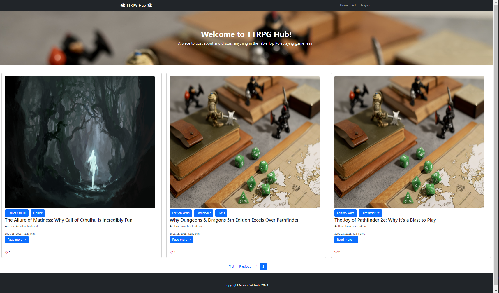

# _TTRPG Hub_

---

# Introduction

TTRPG Hub is a blog website desogned to spark engagement and discussion amongst the Tabletop Roleplaying Game (TTRPG) community. Users can comment and like blog posts, but also vote on polls. The link to the live website is [here] (https://ttrpg-hub-84db70afcadd.herokuapp.com/). 
## Technologies used
- [Python](https://www.python.org/) was one of the main programming languages used to create this project.
- [VScode](https://code.visualstudio.com/) was the editor used to write my code.
- [Javascript](https://www.javascript.com/) was used to make the website more interactive.
- [HTML](https://en.wikipedia.org/wiki/HTML) and [CSS](https://en.wikipedia.org/wiki/CSS) was used to present content to the user on the front end.

---

## User stories

| Title | Number | Definition | Completed? | Label |
|-------|--------|------------|------------|-------|
| USER STORY: Edit and Delete Comments | [#1](https://github.com/Dekeypetey40/TTRPG-Hub/issues/1) | As a user, I want to be able to delete and edit my comments, so that update or remove my comments if I need to. | [x] | Must Have |
| USER STORY: See full blog post | [#2](https://github.com/Dekeypetey40/TTRPG-Hub/issues/2) | As a user, I can click on a blog post title, so that view the entirety of the post. | [x] | Must Have |
| USER STORY: View Comments | [#3](https://github.com/Dekeypetey40/TTRPG-Hub/issues/3) |As a admin or site user, I want to read comments on a blog post, so that I can see what the community thinks about the post. | [x] | Must Have |
| USER STORY: View post likes | [#4](https://github.com/Dekeypetey40/TTRPG-Hub/issues/4) | As a admin or site user, I want to how many likes a post has, so that I can see how popular it is. | [x] | Must Have |
| USER STORY: Moderate Blog Content | [#5](https://github.com/Dekeypetey40/TTRPG-Hub/issues/5) | As an admin, I want to be able to create, edit, update, and delete posts, so that can control the content on the site. | [x] | Must Have |
| USER STORY: Moderate comments | [#6](https://github.com/Dekeypetey40/TTRPG-Hub/issues/6) | As an admin, I want to be able to create, edit, update, and delete comments, so that can control the content on the site. | [x] | Must Have |
| USER STORY: Like Feature | [#7](https://github.com/Dekeypetey40/TTRPG-Hub/issues/7) | As a user, I want to be able to like posts, so that the post author knows I like their content. | [x] | Must Have |
| USER STORY: Comment Like Feature | [#8](https://github.com/Dekeypetey40/TTRPG-Hub/issues/8) | As a user, I can like other user's comments, so that show which comments I like. | [ ] | Could Have |
| USER STORY: Comment Feature | [#9](https://github.com/Dekeypetey40/TTRPG-Hub/issues/9) | As a user, I can comment on blog posts, so that I can interact with the community. | [x] | Must Have |
| USER STORY: Paginated Post Content | [#10](https://github.com/Dekeypetey40/TTRPG-Hub/issues/10) | As a site user, I want to see paginated content, so that I can easily view the content I want without being overwhelmed. | [x] | Should Have |
| USER STORY: Make an Account | [#11](https://github.com/Dekeypetey40/TTRPG-Hub/issues/11) | As a new user, I can easily make an account for the website, so that I can interact with the community. | [x] | Must Have |
| EPIC: Home Page | [#12](https://github.com/Dekeypetey40/TTRPG-Hub/issues/12) |  As a new user, I want to see a home page that makes the site's purpose clear, so that I can quickly determine if I am interested in the site. | [x] | Must Have |
| USER STORY: Add Tag Feature | [#13](https://github.com/Dekeypetey40/TTRPG-Hub/issues/13) | As a user, I want to be able to add tags to my posts and view other posts' tags, so that users can quickly get an idea of what a post is about. | [x] | Should Have |
| USER STORY: About Page | [#14](https://github.com/Dekeypetey40/TTRPG-Hub/issues/14) | As a user, I can read what the blog is all about, so that I can understand the blog's purpose. | [x] | Could Have |
| USER STORY: TTRPG Poll | [#15](https://github.com/Dekeypetey40/TTRPG-Hub/issues/15) | As a user, I can vote for which TTRPG is my favorite, so that I can interact with the community. | [x] | Should Have |
| USER STORY: Write Drafts | [#16](https://github.com/Dekeypetey40/TTRPG-Hub/issues/16) | As an Admin, I can create draft posts, so that I can finish writing a post when I want. | [x] | Should Have |
| USER STORY: One like per user on polls | [#17](https://github.com/Dekeypetey40/TTRPG-Hub/issues/17) | As an admin, I want to users to only be able to vote once on polls, so that my polls' results do not get skewed by individual users. | [x] | Should Have |
---

# Design

## Planning

### Flow Chart

# Features

---

# Future Features

---

# Testing

## Validator testing

- Code Institutes [python linter](http://pep8ci.herokuapp.com/) was used to validate the code:
  - Some trailing and missing whitespaces were addressed, but there were no major issues.
  - Somehow my fixes were not reflected in my last commit so the code was fixed an additional time to pass PEP8 standards.
  - Fixes were also made for the ASCII art python file.

* Lighthouse in Chrome Developer Tools was used.

---

## Bugs

## Solved bugs

---

## Unsolved bugs

## Manual Testing

| feature | action | expected result | tested | passed | comments |
| --- | --- | --- | --- | --- | --- |

---

# Deployment

* This site was deployed by completing the following steps:

1. Log in to [Heroku](https://id.heroku.com) or create an account.
2. On the main page click the button labelled New in the top right corner and from the drop-down menu select Create New App.
3. You must enter a unique app name.
4. Select your region.
5. Click Create App .
6. Navigate to the settings tab and then to Config Vars.
7. Click Reveal Config Vars and enter port into the Key box and 8000 into the Value box and click the Add button.
8. Next, scroll down to the Buildpack section click Add Buildpack select python and click Save Changes.
9. Repeat step 8 to add node.js. o Note: The Buildpacks must be in the correct order. If not click and drag them to move into the correct order.
10. Scroll to the top of the page and choose the Deploy tab.
11. Select Github as the deployment method.
12. Confirm you want to connect to GitHub.
13. Search for the repository name and click the connect button.
14. Scroll to the bottom of the deploy page and select the preferred deployment type.
15. Click either Enable Automatic Deploys for automatic deployment when you push updates to Github.

---

# Credits

## Python Libraries

- Cloudinary
  - Storage for static files
- AllAuth
  - This librared allowed for a seamless integration for user accounts and their validation on the site.
- crispy-bootstrap5 and crispy-forms
  - This allowed for easy to use forms that are compatible with bootstrap 5 templates
- Django
  - This framework made it fast and relatively easy to make a full-stack website.
- Django-taggit
  - This library allowed for easy implementation of tags for my blog posts. Furthermore, it allows users to filter posts by their tag.
- Bootstrap 5
  - A great css framework to easily style web pages. There is lots of free templates available and they are easy to modify to my needs.
- Django-heroku
  - This library fixed a bug I had where my custom css would not work properly on Heroku.

## Content

- A huge thank you to my mentor Aleksei Konovalov for all of his help throughout this process.
- The method to paginate something compatible with Bootstrap 5 and the current Django was from [ourcodeword](https://ourcodeworld.com/articles/read/1757/how-to-implement-a-paginator-in-a-django-class-based-listview-compatible-with-bootstrap-5)
- My knowledge on how to use django-taggit was gained through the [BugBytes](https://www.youtube.com/watch?v=213swbH8j_o&ab_channel=BugBytes) Youtube channel.
- Flaticon and hero image were taken from [Freepik](https://www.freepik.com/)
- My login/logout form templates were taken from dvrrajashekhar on [freefrontend](https://freefrontend.com/bootstrap-login-forms/#gsc.tab=0)

---
