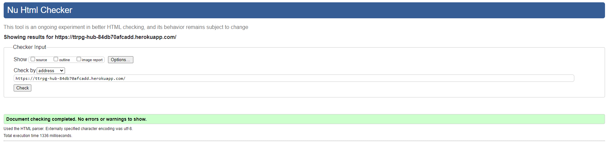
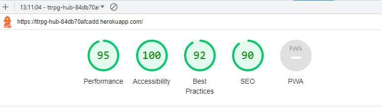

# Testing

## Manual Testing

### Admin Panel

### Add/Edit Recipe

### Account Section - Login/Signup

### 404 Error Page

## Responsive Design

### Below is now the screen at the size of a Medium Screen iPad Air

## Validation

### PEP8 Compliant

All python code written by me passes PEP8 standards using the [CI Python Linter](https://pep8ci.herokuapp.com/).

### HTML W3C Validator

All HTML code passed through the [W3C HTML validator](https://validator.w3.org/#validate_by_uri).

### Jigsaw CSS Validator

All css code passes validation

### Lighthouse Validation

## Bugs

Bug 1

- Problem: My custom css would not load on my website when hosted on heroku. It said the file was of the wrong type (MIME).
- Solution: With consultation from my mentor I realized that this is a common problem with heroku. I installed the django-heroku library and after setting it up my css file worked with no issues.

Bug 2

- Problem: When I modified my vote and post model to include a user/author respectively the console informed me it needed some kind of placeholder for the objects already created based on the new model property.
- Solution: I input the following perameters into the user variable. A almost identical solution to the below can be found in the Post model.

Bug 3

- Problem: It appeared that my polls url was not using the template I had assigned to it. All that displayed on the front end was the base.html template with no content in the middle.
- Solution: After adjusting the view.py, models.py, and urls.py files I realized I had simply forgotten to include the block content tag on my poll templates.

## Unfixed Bugs
