# Testing

## Manual Testing
|     | User Actions           | Expected Results | Y/N | Comments    |
|-------------|------------------------|------------------|------|-------------|
| Sign Up     |                        |                  |      |             |
| 1           | Click on the register button | Redirected to register page | Y |          |
| 2           | Click on Sign Up | User is logged in and receives a message | Y |          |
| 3           | Enter valid email | Field will only accept email address format | Y |          |
| 4           | Enter valid username | Username field will only accept characters + unique username | Y |          |
| 5         | Enter valid password | Field will only accept secure passwords | Y |          |
| 6          | Enter valid password confirmation | Field will only accept the same password from the previous field | Y |          |
| 7          | Click the sign in link| Takes user to the sign in page | Y |          |
| Log In      |                        |                  |      |             |
| 1           | Click on Login button in the navbar | Brought to login page | Y |          |
| 2           | Click on the SignUp link in the form | Redirected to the sign up page | Y |          |
| 3           | Enter valid username | Field will only accept username format | Y |          |
| 4           | Enter valid password | Field will only accept correct passwords | Y |          |
| 5           | Click on the Sign In button | Takes user to the index page abd receives confirmation message | Y |          |
| 6           | Click "Logout" in the navbar | Takes user to log out page to confirm logout | Y |          |
| 7           | Click "Logout" button on the page | Redirects user to index page and receive confirmation message | Y |          |
| Navbar     |                        |                  |      |             |
| 1          | Click "Home" in the navbar | Brings user to Home page | Y |          |
| 2          | Click "Polls" in the navbar | Brings user to polls page | Y |          |
| 3          | Click "Logout" in the navbar | Brings user to loggout page | Y |          |
| 4          | Click "Register" in the navbar | Brings user to sign up page | Y |          |
| 5          | Click "log in" in the navbar | Takes user to log in page | Y |          |
| 6          | Click the logo on the right in the navbar | Takes user to home page | Y |          |
| Home Page  |                        |                  |      |             |
| 1        | Click on a tag button | User redirected to a page with posts only with that tag | Y |          |
| 2      | Click on read more button | Redirects user to the post assigned to the read more button | Y |          |
| 3        | Click on the pagination meny | Redirects user to the correct page | Y |          |
| Blog post  |                        |                  |      |             |
| 1        | Click on the like button while signed out | Nothing happens | Y |          |
| 2        | Click on the like button while signed in | The heart is filled in and the number of likes increases. | Y |          |
| 3  | Write a comment while signed in | User is informed the comment is awaiting approval and comment appears when approved| Y | Edit and Delete buttons only appear beside comments that you are the owner of.   |
| 4  | Click on the delete button  | User is redirected to the delete comment confirmation page | Y |          |
| 5  | Click on the edit button  | User is redirected to the edit comment page | Y |          |
| 6  | Click on the confirm delete button  | User's comment is deleted | Y |          |
| 7  | Edit a user comment  | User receives confirmation their comment is edited and this is reflected immediately | Y |          |
| 8  | Visit the delete comment url while not signed in as that user  | User is redirected to a page saying you can only modify comments if you are the user that created them | Y |          |
| 9  | Visit the edit comment url while not signed in as that user  | User is redirected to a page saying you can only modify comments if you are the user that created them | Y |          |
| Polls Page  |                        |                  |      |             |
| 1     | Click on the vote button on a poll | Redirects user to the vote page for the poll they clicked on | Y |          |
| 2    | Vote on a poll while signed in | User is shown the results of the poll receives a thank you for voting message | Y |          |
| 3    | A user tries to vote again | User receives a message saying they may only vote once | Y |          |
| 4    | Vote on a poll without being signed in | User is told they must sign in to be able to vote | Y |          |
| Admin Panel  |                        |                  |      |             |
| 1    | Open admin url while signed in as a regular user | User is informed they are not authorized and is prompted to sign in with a different account  | Y |          |
| 2    | Sign in as the superuser | Redirects user to the admin panel | Y |          |
| 3   | Click on any of the models in the admin panel | User sees a list of the objects with that model | Y |     |
| 4    | Click a specific object within the list of models  | User is shown the properties of that object | Y |  The user may modify, delete, or add objects from this page    |
| 5     | Click "add x" where x = a model object | The user is redirected to a page where they fill in details for that model object || Y | Once the user saves their created object they receive confirmation at the top of the page|
| 6     | Click delete on an object | User is taken to delete confirmation page and upon confirmation receive a message at the top of the page | Y |   |
| 7     | Approve a user comment | The comment shows as approved and all users can then view that comment | Y |    |
| 8         | Unapprove a user comment | The comment can only be seen by the admin until the comment is approved | Y |          |
| 9       | Edit a post | The content of the post reflects the changes made | Y |          |
| 404 Page  |                        |                  |      |             |
| 1        | Enter an invalid url  | User redirected to a custom 404 error page | Y |          |
| 500 Page  |                        |                  |      |             |
| 1        | Trigger a 500 error | User redirected to a custom 500 error page | Y |          |

---

## Responsive Design

### Homepage and Blog Post

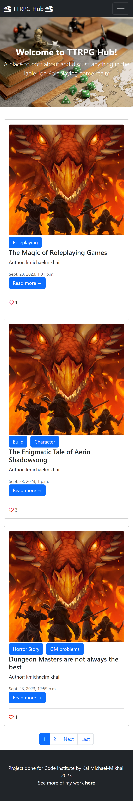
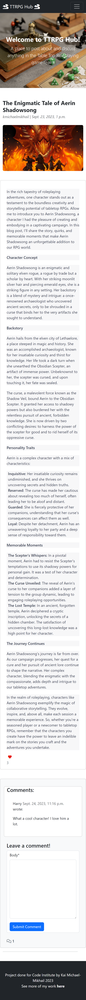

### Polls

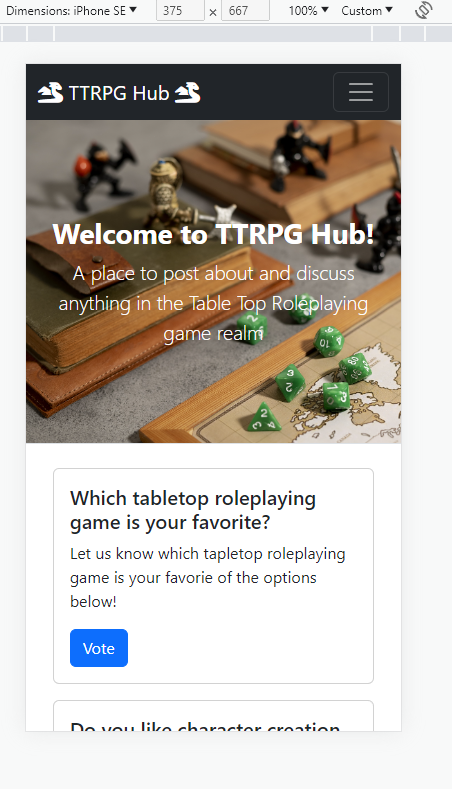
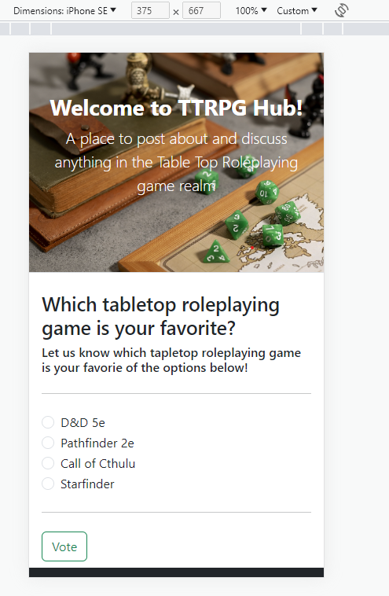

### Login, Logout, Register

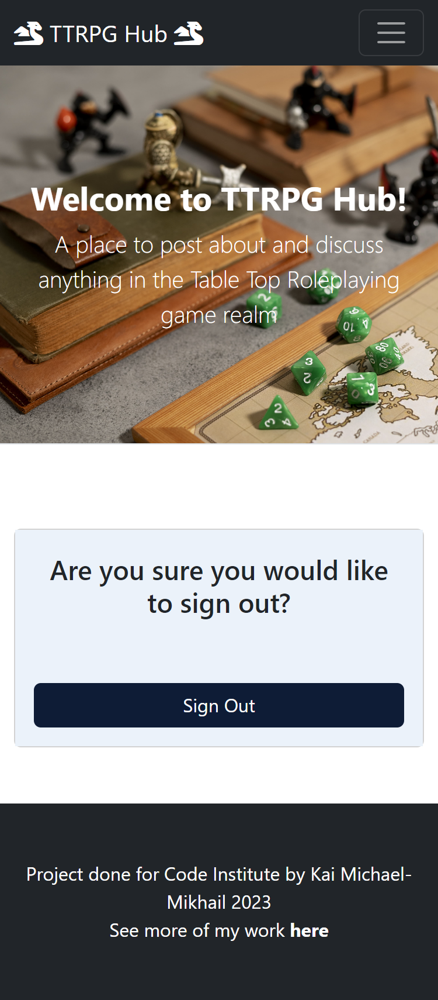
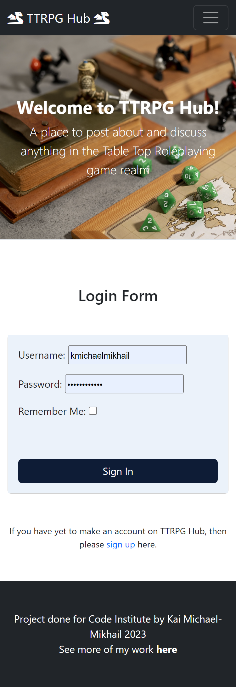
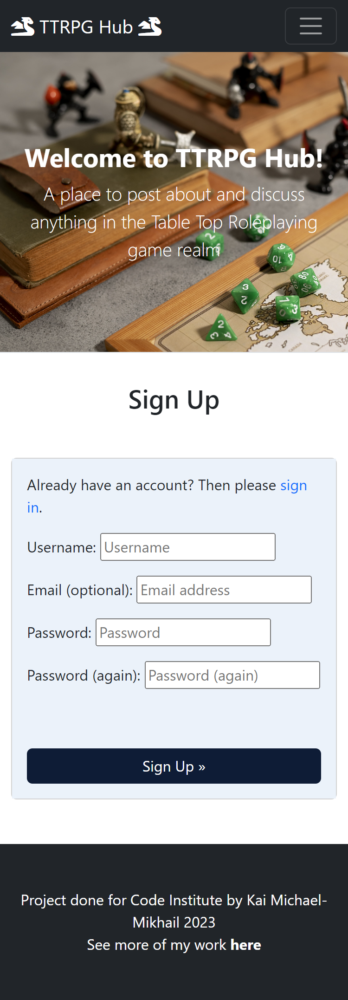

## Validation

### PEP8 Compliant

All python code written by me passes PEP8 standards using the [CI Python Linter](https://pep8ci.herokuapp.com/).

### HTML W3C Validator

All HTML code written by me passed through the [W3C HTML validator](https://validator.w3.org/#validate_by_uri).
- An enormous amount of errors appears when a lot of formatting is applied to the blog post's content. 
- The code that produces the errors is not written by me, but is what is produced by the {{post.content|safe}} tag.
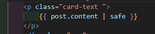
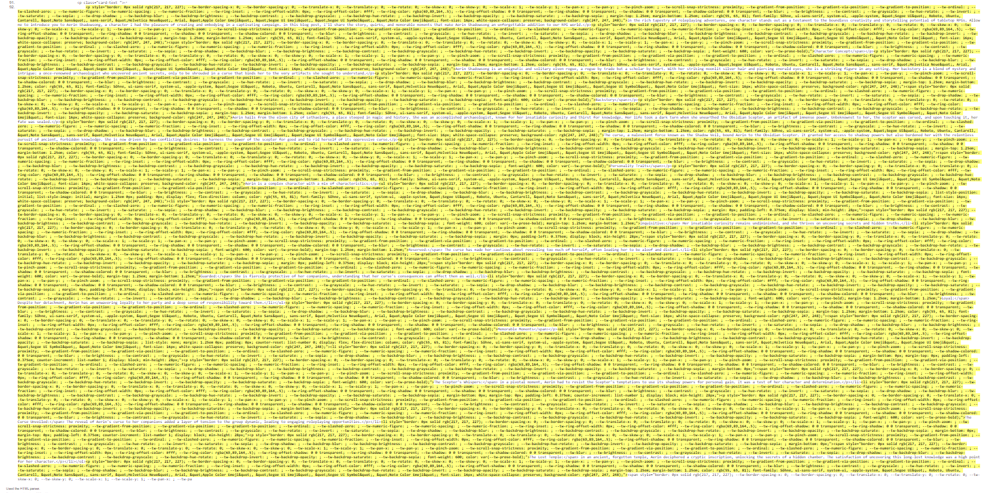

### Jigsaw CSS Validator

All css code passes validation

### Lighthouse Validation

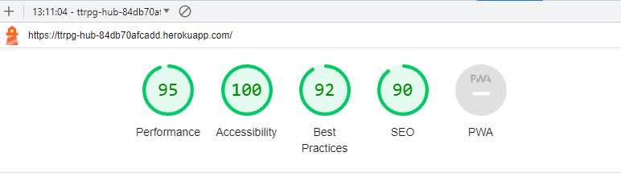

## Bugs

Bug 1

- Problem: My custom css would not load on my website when hosted on heroku. It said the file was of the wrong type (MIME).
- Solution: With consultation from my mentor I realized that this is a common problem with heroku. I installed the django-heroku library and after setting it up my css file worked with no issues.

Bug 2

- Problem: When I modified my vote and post model to include a user/author respectively the console informed me it needed some kind of placeholder for the objects already created based on the new model property.
- Solution: I input the following perameters into the user variable. A almost identical solution to the below can be found in the Post model.
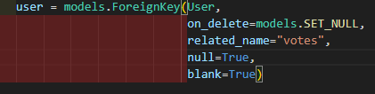

Bug 3

- Problem: It appeared that my polls url was not using the template I had assigned to it. All that displayed on the front end was the base.html template with no content in the middle.
- Solution: After adjusting the view.py, models.py, and urls.py files I realized I had simply forgotten to include the block content tag on my poll templates.

Bug 3

- Problem: Reverse was not working and I got a 404 error when a user who was not logged in tried to vote.
- Solution: After googling I found out I had to add redirect to reverse. This solved the problem.

## Unfixed Bugs

- There are no unsolved bugs.
